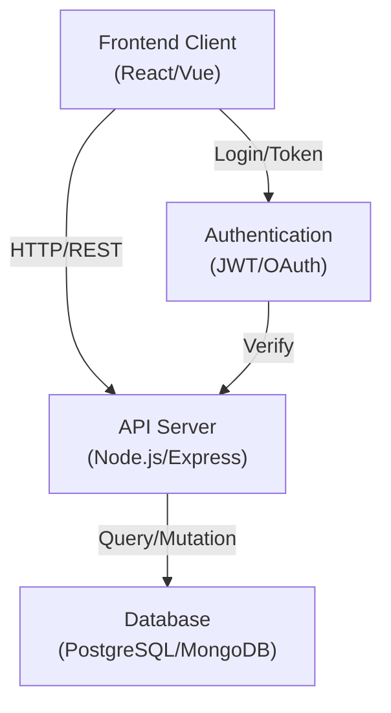

# Welcome to your Lovable project

## What it does

This is a Lovable project — a modern web application built with a full-stack JavaScript framework. It provides a foundation for building interactive, responsive web applications with integrated frontend and backend capabilities. Perfect for teams looking to ship features quickly without boilerplate overhead.

## Architecture

## Stack

## Setup

1. **Prerequisites**: Node.js 16+ and npm/yarn installed
2. **Clone the repository**: `git clone <repo-url> && cd <project-name>`
3. **Install dependencies**: `npm install`
4. **Configure environment**: Copy `.env.example` to `.env` and fill in required variables
5. **Start development server**: `npm run dev`
6. **Open in browser**: Navigate to `http://localhost:3000`

## Results / Metrics

📊 Add your own metrics here (response time, accuracy, users, deployment status, etc.)

---

**Next steps**: Replace this template with your project's actual documentation, architecture diagram, and performance metrics.
